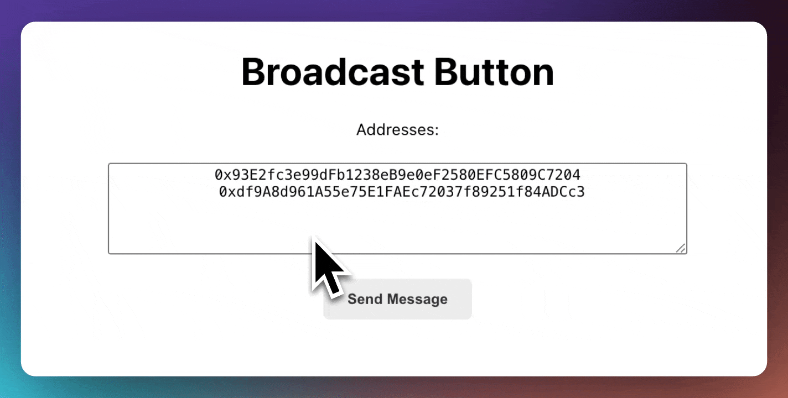

# How to Broadcast with XMTP

This tutorial will guide you on how to create a simple `Broadcast` that enables the user to broadcast messages to one or many specified Ethereum addresses.



<div className="widget-container">
  <Broadcast
    env="production"
    walletAddresses={[
      "0x93E2fc3e99dFb1238eB9e0eF2580EFC5809C7204",
      "0xdf9A8d961A55e75E1FAEc72037f89251f84ADCc3",
    ]}
    placeholderMessage="Enter a broadcast message here"
    onMessageSuccess={(message) =>
      console.log("Message sent" + message.content)
    }
  />
</div>

#### Import XMTP Client and Ethers Library

The code starts by importing the required XMTP and Ethereum packages. This enables you to create an XMTP client and interact with the Ethereum blockchain.

```jsx
import { Client } from "@xmtp/xmtp-js";
import { ethers } from "ethers";
```

#### Set up the `walletAddresses` Array

The Broadcast function accepts a walletAddresses array. This array holds the Ethereum addresses that you intend to broadcast messages to.

```jsx
walletAddresses = [
  "0x93E2fc3e99dFb1238eB9e0eF2580EFC5809C7204",
  "0xa64af7F78DE39A238Ecd4ffF7D6D410DBACe2dF0",
];
```

#### Rate Limiting

Keep in mind that the XMTP client limits up to 1,000 publish requests per 5 minutes. It's important to be aware of this when broadcasting messages, especially when dealing with a large array of wallet addresses.

_For more information check the [FAQs](https://xmtp.org/docs/faq#rate-limiting)_

#### Check which addresses can receive messages

In the `handleBroadcastClick` function, the `canMessage` method checks which of the wallet addresses from the array can receive messages.

```jsx
// Create a new XMTP client with the signer and environment
const xmtp = await Client.create(signer, { env: env });
// Check if the client can message the provided wallet addresses
const broadcasts_canMessage = await xmtp.canMessage([walletAddresses]);
```

_This will return an array of booleans that correspond to the wallet addresses. If the boolean is true, the address can receive messages. If the boolean is false, the address cannot receive messages._

#### Check if has given consent to the sender

The `isAllowed` method checks if the wallet address has given consent to the sender. If the address has not given consent, the sender cannot send messages to the address. To learn more about consent check out the tutorial

```jsx
xmtp.contacts.isAllowed(wallet);
```

#### Refresh the Consent List

To ensure we're working with the most up-to-date information, refresh the consent list before doing the broadcast.

```jsx
await xmtp.contacts.refreshConsentList();
```

#### Loop through wallet address array to broadcast

Here, you loop through the `walletAddresses` array. For each address that can receive messages, a new conversation is started and the message is sent.

```jsx
// Create a new XMTP client with the signer and environment
const xmtp = await Client.create(signer, { env: env });
// Check if the client can message the provided wallet addresses
const broadcasts_canMessage = await xmtp.canMessage(walletAddresses);
//Update consent list
await xmtp.contacts.refreshConsentList();
// Loop through the wallet addresses
for (let i = 0; i < walletAddresses.length; i++) {
  const wallet = walletAddresses[i];
  const canMessage = broadcasts_canMessage[i];
  // If the address can receive messages and has allowed consent
  if (canMessage && xmtp.contacts.isAllowed(wallet)) {
    // Create a new conversation with the wallet address
    const conversation = await xmtp.conversations.newConversation(wallet);
    // Send the broadcast message to the conversation
    const sent = await conversation.send(broadcastMessage);
    // If a callback function is provided, call it with the sent message
    if (onMessageSuccess) {
      onMessageSuccess(sent);
    }
  }
}
```

#### Popup UI

A modal pops up when the user opts to send a message. This modal contains a text area for the user to input their message. Also handles `isLoading` and `messageSent` states.

```jsx
{
  showPopup && (
    <div style={styles.ubContainer}>
      <textarea
        style={styles.textArea}
        placeholder={placeholderMessage}
        value={broadcastMessage}
        onChange={(e) => setBroadcastMessage(e.target.value)}
        disabled={loading}
      />
    </div>
  );
}
```
